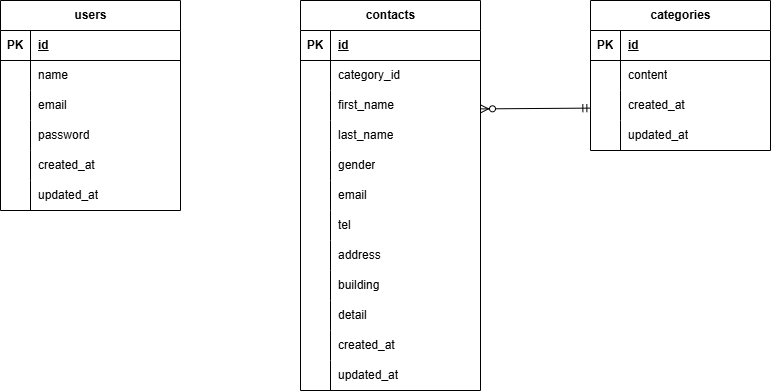

# FashionablyLate(お問い合わせフォーム)

## 環境構築
**Dockerビルド**
1. `git clone git@github.com:sayouta1224/fashionably-late2.git`
2. DockerDesktopアプリを立ち上げる
3. `docker-compose up -d --build`

> *MySQLは、OSによって起動しない場合があるのでそれぞれのPCに合わせてdocker-compose.ymlファイルを編集してください。*

**Laravel環境構築**
1. `docker-compose exec php bash`
2. `composer install`
3. env.exampleファイルから.envを作成し、環境変数を変更
```text
DB_CONNECTION=mysql
DB_HOST=mysql
DB_PORT=3306
DB_DATABASE=laravel_db
DB_USERNAME=laravel_user
DB_PASSWORD=laravel_pass
```
4. アプリケーションキーの作成
``` bash
php artisan key:generate
```
5. マイグレーションの実行
```bash
php artisan migrate
```
6. シーディングの実行
```bash
php artisan db:seed
```

## 使用技術(実行環境)
- PHP 8.1
- Laravel 8.83.8
- MySQL 8.0.26

## ER図


## URL
- 開発環境：http://localhost/
- phpMyAdmin：http://localhost:8080/

